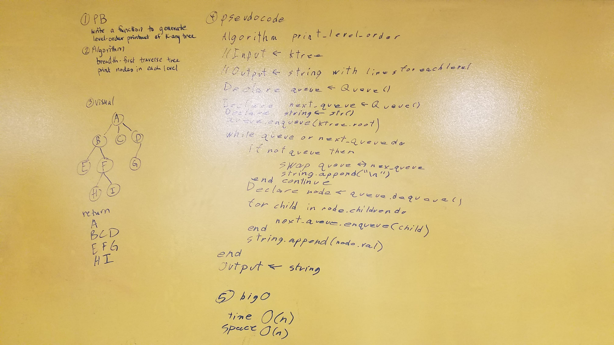

# K-ary Tree

## Implement a K-ary Tree

- Create a new branch in your data-structures-and-algorithms repository called k-tree. If you call it anything else, you will get ZERO CREDIT with NO COMMENTS
- Create a new directoruy called k_tree/, with all of your standard module configuration for each directory
    - __init__.py, README.md, etc.
- Create a file called k_tree.py, as well as a test file and a config file for your tests.
- In k_tree.py:
    - Create a Class or a Node which is aware of the value as val and children as a list collection of Nodes
        - Ensure that you have a __repr__ and __str__ method defined to return appropriate representations of the node
    - Create a Class for a KTree, which is aware of the root of the tree as root
        - Ensure that you have a __repr__ and __str__ method defined to return appropriate representations of the tree
        - This class should be aware of depth-first traversal methods for pre_order, and post_order traversals
        - This class should be aware of a breadth-first traversal method
        - This class should have the ability to insert a new node into the tree at a given parent node
- Ensure that your class and any subsequent methods are properly tested, and that your test coverage is above 80%.

### Whiteboard Challenge - Print Level Order
Write a function to generate a level-order printout of a k-ary tree. That is, given a tree, display the node values, with new lines between each level of the tree.

Write a function based on the specifications above, which takes in a k-ary tree. Without utilizing any of the built-in methods available to your language, return a string that contains a listing of all values in the tree, with new lines in-between each level of the tree.

Write at least three test assertions for each method that you define.Ensure your tests are passing before you submit your solution.

