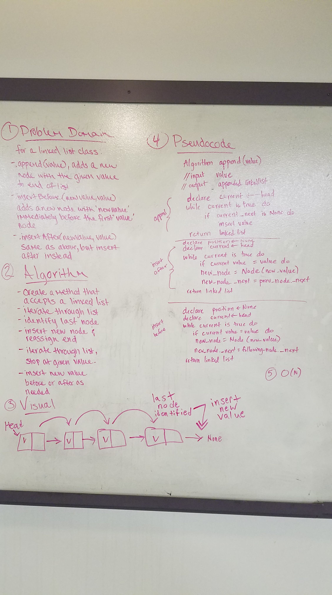
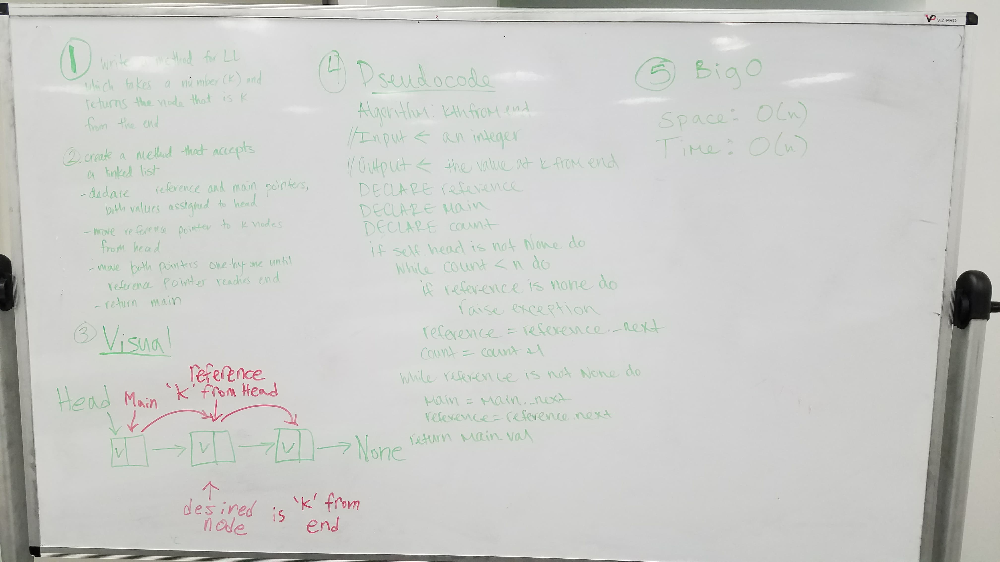
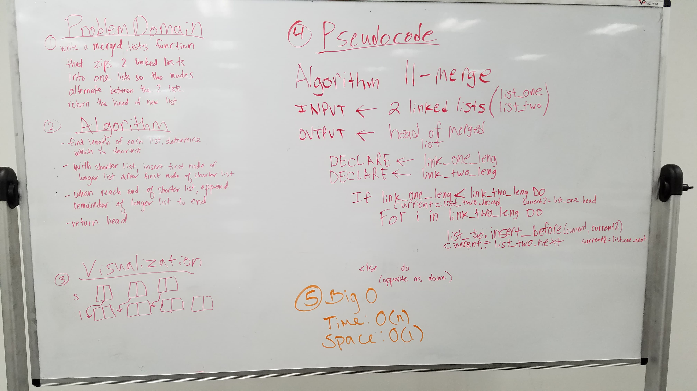
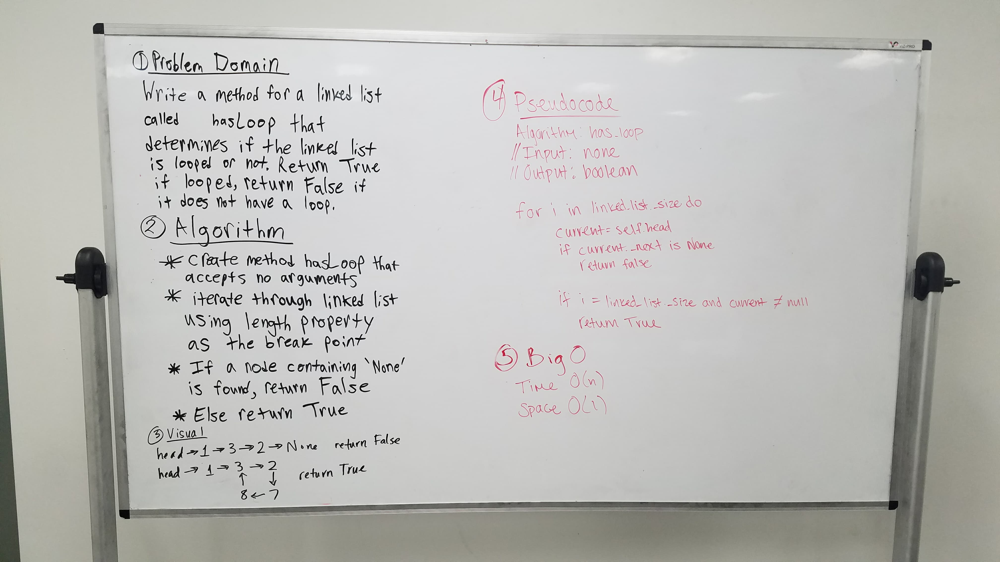

## Data Structures
### Linked Lists
- Create two files called node.py and linked_list.py in your linked_list directory
- Create a Class for a Node which is aware of the value as val and next as _next
- Ensure that you have a __str__ method defined to return the value of the node when printed
- Create a Class for a LinkedList which creates an empty Linked List when instantiated.
- This class should be aware of a default None value assigned to head when the list is created.
- This class should be aware of the len of the list, which represents the count of Nodes in the list at any time
- This class should have the ability to accept an iterable as an argument when instantiated, such as [1, 2, 3, 4], and creates a new Node in the list for each value in the iterable.
- Define any further magic methods such as len and str to support user functionality and informative responses.
- Define a method called insert which takes any value as an argument and adds that value to the head of the list with an O(1) Time performance.
- Define a method called find which takes any value as an argument and returns True or False depending on whether that value exists as a Node value within the list.
- At no time should an exception or stack trace be show to the end user. Catch and handle any such exceptions and return a printed value or operation which cleanly represents the state and either Stops execution cleanly or provides the user with clear direction and output.
- Every bit of functionality that you have should be tested and documented.

#### Whiteboard Challenge (Day 6) Insertions:
Write the following methods for the Linked List class:
- .append(value) which adds a new node with the given value to the end of the list
- .insertBefore(value, newVal) which add a new node with the given newValue immediately before the first value node
- .insertAfter(value, newVal) which add a new node with the given newValue immediately after the first value node

You have access to the Node class and all the properties on the Linked List class. Write at least three test assertions for each method that you define. Ensure your tests are passing before you submit your solution.

#### Whiteboard Challenge (Day 7)  k-th value from the end of a linked list:
Write a method for the Linked List class called kthFromEnd which takes a number, k, as an argument. Return the node that is k from the end of the linked list. You have access to the Node class and all the properties on the Linked List class as well as the methods created in previous challenges. Write at least three test assertions for each method that you define. ​ Ensure your tests are passing before you submit your solution. ​

#### Whiteboard Challenge (Day 8)  Merge two linked lists:
Write a function called mergeLists which takes two linked lists as arguments. Zip the two linked lists together into one so that the nodes alternate between the two lists and return a reference to the head of the single list. Try and keep additional space down to O(1). You have access to the Node class and all the properties on the Linked List class as well as the methods created in previous challenges. Write at least three test assertions for each method that you define. Ensure your tests are passing before you submit your solution.

#### Whiteboard Challenge (Day 9)  Identify a circular reference in a linked list:
Write a method for the Linked List class called hasLoop which takes no arguments. Return a boolean that indicates whether or not a circular reference or loop is present in the linked list. Your implementation must not use any additional memory or modify the nodes of the linked list. You have access to the Node class and all the properties on the Linked List class as well as the methods created in previous challenges. Write at least three test assertions for each method that you define. Ensure your tests are passing before you submit your solution.

